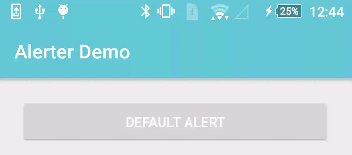

# React Native Notification Banner



## Installation

```sh
"react-native-notification-banner": "sergeymild/react-native-notification-banner#0.8.6"
```

## Usage

```js
import NotificationBanner from "react-native-notification-banner";


interface Style {
  backgroundColor?: string;
  titleColor?: string;
  messageColor?: string;
  icon?: ImageSourcePropType;
  titleFont?: {
    size?: number;
    // IOS only
    family?: string;
  };
}

interface ConfigurationParams {
  cornerRadius?: number;
  margin?: number;
  padding?: number;

  // Android only
  elevation?: number;

  // IOS only
  readonly shadow?: {
    offset: { width: number; height: number };
    color: string;
    radius: number;
    opacity: number;
  };

  readonly error?: Style;
  readonly success?: Style;
}

NotificationBanner.configure(ConfigurationParams);

// ...
interface Params {
  title?: string;
  message?: string;
  style?: 'success' | 'error' | 'info';
  duration?: number;
  icon?: number;
  onPress?: () => void;
}
NotificationBanner.show(params);
```
